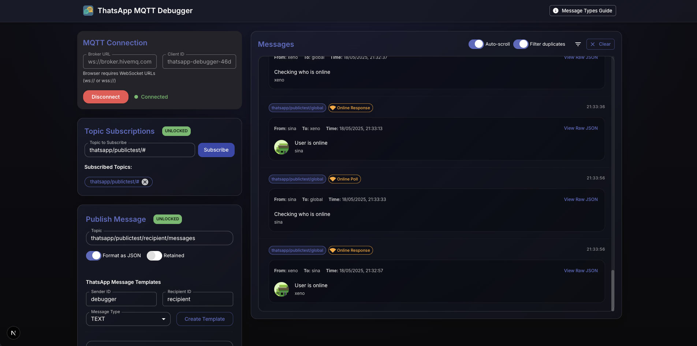

# ThatsApp MQTT Debugger

A feature-rich MQTT debugging tool designed specifically for ThatsApp messaging protocol development and testing. This web-based application allows you to easily connect to MQTT brokers, subscribe to topics, publish messages, and monitor real-time communication.



## 🔗 Live Demo

Try it now: [thatsapp.doruk.ch](https://thatsapp.doruk.ch)

## 🚀 Features

### Connection & Subscription
- **Connect to any MQTT broker** with WebSocket support (ws:// or wss://)
- **Subscribe to multiple topics** with support for wildcards
- **Visual connection status** with real-time indicator

### Message Publishing
- **Publish messages** with customizable payload and retained flag
- **ThatsApp message templates** for quick testing with proper JSON formatting
- **Support for all message types**:
  - Text messages
  - Image messages
  - Location sharing
  - Profile updates and requests
  - Typing indicators
  - Online status polls and responses
- **JSON formatting** with automatic validation

### Real-time Message Viewing
- **Interactive message display** with syntax highlighting and formatting
- **Message type detection** with appropriate icons and styling
- **Retained message indicators** for distinguishing standard and retained messages
- **Message filtering** by topic to focus on specific communication
- **Duplicate detection** to clean up repetitive messages
- **Auto-scroll toggle** to follow new messages or pause to inspect
- **New message notifications** when scrolled away from latest messages
- **Animation effects** for new messages with visual indicators
- **Smooth performance** even with high message volumes

### User Interface
- **Responsive design** that works on all devices (desktop, tablet, mobile)
- **Collapsible filters** for a cleaner interface
- **Interactive components** with hover and animation effects
- **Consistent spacing** and visual hierarchy
- **Custom scrollbars** for better usability
- **High-performance animations** using Framer Motion

### Developer Tools
- **Message Types Guide** with comprehensive protocol documentation
- **Copy-paste example code** for each message type
- **Implementation notes** to ensure cross-client compatibility
- **Common mistakes documentation** to avoid protocol errors
- **Topic structure guide** for proper addressing

## 📋 Detailed Usage Guide

### MQTT Connection

#### Establishing a Connection

1. When you first open the debugger, you'll see the MQTT Connection panel
2. The default broker URL is set to `ws://broker.hivemq.com:8000/mqtt` (a public test broker)
3. A random client ID is generated for you automatically
4. Click the "Connect" button to establish a connection

#### Connection Security

- When using the tool on an HTTPS site, it will automatically upgrade WebSocket connections to secure WSS
- The connection status indicator shows green when connected and red when disconnected
- The connection pulses to indicate active connection status

#### Custom Brokers

You can connect to any MQTT broker that supports WebSocket connections:

- Public brokers like HiveMQ, Mosquitto, or EMQ X
- Self-hosted brokers with WebSocket enabled
- Cloud MQTT services (ensure they support WebSockets)

### Topic Subscription

#### Subscribing to Topics

1. After connecting, use the Topic Subscriptions panel
2. Enter a topic or topic pattern in the input field
   - Example: `thatsapp/publictest/#` to subscribe to all ThatsApp public test messages
   - Example: `thatsapp/publictest/user123/messages` for a specific user's messages
3. Click "Subscribe" to add the subscription
4. The topic appears in the list below with an option to unsubscribe

#### Using Wildcards

MQTT supports two wildcards:
- Single-level (`+`): Matches exactly one topic level
  - Example: `thatsapp/+/messages` matches `thatsapp/user1/messages` but not `thatsapp/user1/inbox/messages`
- Multi-level (`#`): Matches any number of topic levels (must be the last character)
  - Example: `thatsapp/#` matches all topics that start with `thatsapp/`

#### Managing Subscriptions

- You can subscribe to multiple topics simultaneously
- Each subscription is listed with an unsubscribe button
- Clicking the unsubscribe button immediately removes that subscription

### Publishing Messages

#### Basic Message Publishing

1. Use the Publish Message panel to send messages
2. Enter the destination topic (e.g., `thatsapp/publictest/user456/messages`)
3. Toggle "Format as JSON" if sending structured data
4. Toggle "Retained" if the message should be stored on the broker
5. Enter your message payload in the text area
6. Click "Publish" to send the message

#### Using ThatsApp Templates

For ThatsApp-specific messages:

1. Ensure "Format as JSON" is toggled on
2. Fill in the Sender ID (your identifier)
3. Fill in the Recipient ID (target user or "global")
4. Select a message type from the dropdown
5. Click "Create Template" to generate a template message
6. Edit the template as needed
7. Click "Publish" to send

#### Message Types

The debugger supports all ThatsApp message types:

1. **TEXT**: Simple text messages
   - Payload is the message text itself
   - Example: `"Hello, how are you?"`

2. **IMAGE**: Image sharing
   - Payload is the URL to the image
   - Example: `"https://example.com/images/photo.jpg"`

3. **LOCATION**: Geographic location sharing
   - Payload is a JSON object with latitude and longitude
   - Example: `{"latitude": 47.3769, "longitude": 8.5417}`

4. **PROFILE_UPDATE**: User profile information
   - Payload is a JSON object with name and optional avatarUrl
   - Example: `{"name": "John Doe", "avatarUrl": "https://example.com/avatar.jpg"}`

5. **REQUEST_PROFILE**: Request for profile information
   - Payload is typically empty
   - Used to ask another user to send their profile

6. **TYPING**: Typing indicator
   - Payload is typically empty
   - Indicates a user is currently typing

7. **ONLINE_POLL**: Check who's online
   - Payload contains sender information
   - Sent to the global topic to discover online users

8. **ONLINE_RESPONSE**: Response to online poll
   - Payload contains responder information
   - Sent to the global topic when responding to a poll

### Message Viewer

#### Viewing Messages

The Message Viewer panel displays all received messages based on your subscriptions:

- Messages are displayed in chronological order (newest at the bottom)
- Each message shows the topic, timestamp, and formatted content
- JSON messages are automatically formatted and syntax-highlighted
- ThatsApp messages are formatted according to their type
- Retained messages are marked with a "Retained" label

#### Display Controls

Several controls enhance the viewing experience:

- **Auto-scroll**: Toggle to automatically scroll to new messages (off by default)
- **Filter duplicates**: Toggle to hide duplicate messages within a short timeframe
- **Filter**: Click the filter icon to show/hide topic filtering options
- **Clear**: Remove all messages from the viewer

#### Message Animations

- New messages feature a subtle highlight animation
- When scrolled away from the bottom, a "New messages" indicator appears
- Click the indicator to instantly scroll to the newest messages

#### Performance Optimizations

- The viewer uses virtualization for handling large message volumes
- Animations are throttled during high-volume message periods
- Maximum message count is limited to ensure performance

### Message Types Guide

Access the Message Types Guide by clicking the button in the top-right header.

#### Guide Features

- **Message Types Overview**: Details about each supported message type
- **Recipient Standards**: How to properly address messages
- **Implementation Notes**: Best practices for ThatsApp protocol
- **Common Mistakes**: Issues to avoid when implementing clients
- **Topic Structure**: Standard topic hierarchy for ThatsApp

#### Example Code

Each message type includes an example code section:

1. Click "View Example Code" to show the example
2. Examples include proper JSON formatting with comments
3. Click the copy icon to copy the example to clipboard
4. Use examples as templates for your own messages

### Tips and Tricks

#### Efficient Testing

- Use the "Create Template" button to quickly generate valid messages
- Subscribe to `thatsapp/publictest/#` to see all public test messages
- Use "Filter duplicates" when testing with multiple clients to reduce noise
- Turn off Auto-scroll when examining specific messages

#### Working with Retained Messages

- Use retained messages to persist state information
- Publishing an empty retained message clears previously retained messages
- The "Retained" chip helps identify which messages are persisted

#### Message Debugging

- Use topic filters to focus on specific communication channels
- Examine timestamps to understand message sequence
- Check message formatting to ensure protocol compliance
- Compare sent and received messages to verify correct transmission

### Troubleshooting

#### Connection Issues

- Ensure the broker URL is correct and includes the WebSocket protocol (ws:// or wss://)
- Check that the broker supports WebSockets on the specified port
- Try a different client ID if you suspect ID conflicts
- Verify network connectivity and firewall settings

#### Message Problems

- Verify JSON syntax if messages aren't being properly formatted
- Check topic spelling and structure
- Ensure payload format matches the specified message type
- Verify that recipients are specified correctly for direct messages

#### Performance Considerations

- Limit subscriptions to necessary topics
- Use specific topic patterns instead of broad wildcards
- Enable "Filter duplicates" to reduce message volume
- Clear the message viewer periodically during long sessions

## 💻 Development

The project is built with:

- **Next.js** - React framework for web applications
- **React** - UI library
- **TypeScript** - Type-safe JavaScript
- **Material UI** - Component library
- **Framer Motion** - Animation library
- **Paho MQTT** - MQTT client library for browser

### Project Structure

```
/
├── components/          # React components
│   ├── ConnectionForm.tsx
│   ├── MessagePublisher.tsx
│   ├── MessageViewer.tsx
│   ├── MessageTypesGuide.tsx
│   └── TopicSubscriber.tsx
├── contexts/            # React contexts
│   └── MQTTContext.tsx  # MQTT client management
├── lib/                 # Utility functions
│   └── messageTemplates.ts
├── pages/               # Next.js pages
│   ├── _app.tsx
│   ├── _document.tsx
│   └── index.tsx        # Main application page
├── public/              # Static assets
├── styles/              # CSS styles
└── types/               # TypeScript type definitions
```

### Running Locally

```bash
# Clone the repository
git clone https://github.com/peaktwilight/ThatsAppMQTTDebugger.git

# Navigate to the project directory
cd ThatsAppMQTTDebugger

# Install dependencies
npm install

# Start the development server
npm run dev
```

### Building for Production

```bash
npm run build
npm start
```

## 📱 ThatsApp Message Protocol

ThatsApp uses a simple JSON message format for communication:

```typescript
interface ThatsAppMessage {
  senderId: string;      // Unique ID of the sender
  recipientId: string;   // Unique ID of the recipient or "global"
  timestamp: number;     // Message timestamp in milliseconds
  type: string;          // Message type (TEXT, IMAGE, LOCATION, etc.)
  payload: string;       // Message content (format depends on type)
}
```

### Message Types

The debugger supports all ThatsApp message types:

| Type | Description | Payload Format | Usage |
|------|-------------|---------------|-------|
| TEXT | Regular text messages | String | Direct |
| IMAGE | Image URL messages | URL String | Direct |
| LOCATION | Location data | JSON with latitude, longitude | Direct |
| PROFILE_UPDATE | Profile information | JSON with name, avatarUrl | Direct/Global |
| REQUEST_PROFILE | Profile information request | Empty string | Direct/Global |
| TYPING | Typing indicators | Empty string | Direct |
| ONLINE_POLL | Request to check who's online | JSON with name, avatarUrl | Global |
| ONLINE_RESPONSE | Response to an online poll | JSON with name, avatarUrl | Global |

### Topic Structure

- **Global messages**: `thatsapp/publictest/global`
- **Direct messages**: `thatsapp/publictest/{recipientId}/messages`

## 🔒 Security Considerations

- The app runs entirely in your browser and does not store any data on a server
- Your MQTT connection details and messages are not saved between sessions
- When using the tool on an HTTPS page, it will automatically upgrade insecure WebSocket connections to secure ones (WSS)

## 🚨 Error Handling

The debugger includes comprehensive error handling to help identify and resolve issues:

- **Connection Errors**: Detailed error messages when connection fails, including broker URL validation
- **Operation Errors**: Clear notifications about failures in subscriptions, publications, and message processing
- **Input Validation**: Safeguards against empty topics, malformed messages, and invalid JSON
- **Persistent Connection**: Automatic reconnection attempts when connections drop unexpectedly
- **Visual Indicators**: Error messages are displayed prominently to help users identify and fix problems
- **WebSocket Security**: Automatic protocol upgrade from ws:// to wss:// when using HTTPS

## 📄 License

This project is licensed under the ISC License.

## 🤝 Contributing

Contributions are welcome! Please feel free to submit a Pull Request.

1. Fork the repository
2. Create your feature branch (`git checkout -b feature/amazing-feature`)
3. Commit your changes (`git commit -m 'Add some amazing feature'`)
4. Push to the branch (`git push origin feature/amazing-feature`)
5. Open a Pull Request